# Agentic-Critic: A Multi-Agent AI System

[](https://opensource.org/licenses/Apache-2.0)

An AI system where one LLM generates ideas and another LLM critiques them. You act as the director, guiding their collaboration.

This project is a complete example of how to build a reliable and smart multi-agent system where a user can manage the workflow. It includes a strong testing setup using DeepEval to ensure the AI agents behave as expected.

## 🚀 Key Features

*   **Generator-Critic Team:** One AI agent has the role of a "Generator" to create ideas, code, or text. Another AI agent acts as a "Critic" to review the work, find problems, and suggest improvements.
*   **You are the Director (Human-in-the-Loop):** You have full control. You can talk to the Generator, then send its response to the Critic. You decide what to do next.
*   **Use Different AIs:** The system is flexible. You can use a model from OpenAI (like GPT-4.1) as the Generator and a model from OpenAI (like GPT-5) as the Critic.
*   **Separate Memory for Each Agent:** Each AI only remembers its own conversation with you. This helps them stay focused on their specific role.
*   **High-Quality Testing:** The project is tested with DeepEval. We don't just check for bugs; we check if the AI agents are smart, stick to their roles, and handle strange requests correctly.

## 🏛️ How It Works

The system is managed by a central **Orchestrator**. When you send a message, the Orchestrator directs it to the correct agent. Each agent has its own separate memory.

```mermaid
graph LR
    subgraph "Agentic-Critic System"
        U[👨‍💻 User] --> O{Orchestrator}

        subgraph "Generator Agent"
            A1_LLM[🧠 LLM: OpenAI GPT-4.1]
            A1_Mem[📝 Separate Memory]
        end

        subgraph "Critic Agent"
            A2_LLM[🧠 LLM: OpenAI GPT-5]
            A2_Mem[📝 Separate Memory]
        end

        O -- "talk_to('generator', ...)" --> A1_LLM
        O -- "talk_to('critic', ...)" --> A2_LLM
        A1_LLM -- "Response" --> O
        A2_LLM -- "Response" --> O
        O -- "Final Result" --> U
    end
```



## 🛠️ Tech Stack

*   **Python:** The main programming language.
*   **uv:** For fast project and environment management.
*   **LangChain:** To connect and manage the AI models.
*   **Streamlit:** To create the simple web user interface.
*   **DeepEval:** For testing the quality of the AI's responses.
*   **Pytest:** For running the tests.

## ⚙️ Getting Started

Follow these steps to run the project on your own computer.

### 1. Clone the repository
First, download the code to your machine.
```bash
git https://github.com/scream4ik/forkflux.git
cd forkflux
```

### 2. Create environment and install dependencies
This project uses `uv` for fast installation.
```bash
# Create a virtual environment
uv venv

# Activate it (macOS/Linux)
source .venv/bin/activate
# Or activate it (Windows)
# .\.venv\Scripts\activate

# Install all required libraries
uv sync
```

## 🕹️ How to Use

After installation, you can run the web application.
**No API keys are needed to start the app.**

```bash
streamlit run app/main.py
```
Open your web browser and go to the local URL provided by Streamlit (usually `http://localhost:8501`).

## 🧪 Testing the System

The tests ensure that the AI agents behave correctly. To run the tests, you need to install the developer dependencies and set up an API key.

### 1. Install Developer Dependencies
From your activated virtual environment, run:
```bash
# This command installs everything needed for testing
uv sync --dev
```

### 2. Set the OpenAI API Key
The test suite needs an OpenAI API key to run the evaluations. You only need to set it for your local terminal session.

**(For macOS / Linux)**
```bash
export OPENAI_API_KEY="sk-..."
```

**(For Windows Command Prompt)**
```bash
set OPENAI_API_KEY="sk-..."
```

**(For Windows PowerShell)**
```bash
$env:OPENAI_API_KEY="sk-..."
```

### 3. Run the Tests
Now you can run all the tests with `deepeval`.
```bash
deepeval test run tests/ -c
```
The first time you run the tests, it will be slow because it calls the real AI models. After that, the tests will be very fast because the results are cached.

## 📈 Future Plans

-   [ ] **Add more agent roles:** like a "Tester" to check code, or an "Editor" to improve grammar.
-   [ ] **Give agents tools:** Allow agents to use tools like a web search to find up-to-date information.
-   [ ] **Improve the UI:** Make the user interface more advanced.
-   [ ] **Automate workflows:** Use a tool like LangGraph to create automatic sequences for common tasks.

## 📄 License

Licensed under the [Apache 2.0 License](LICENSE).

## ⭐️ Like the idea?

Star the repo and share feedback — we’re building in the open.
